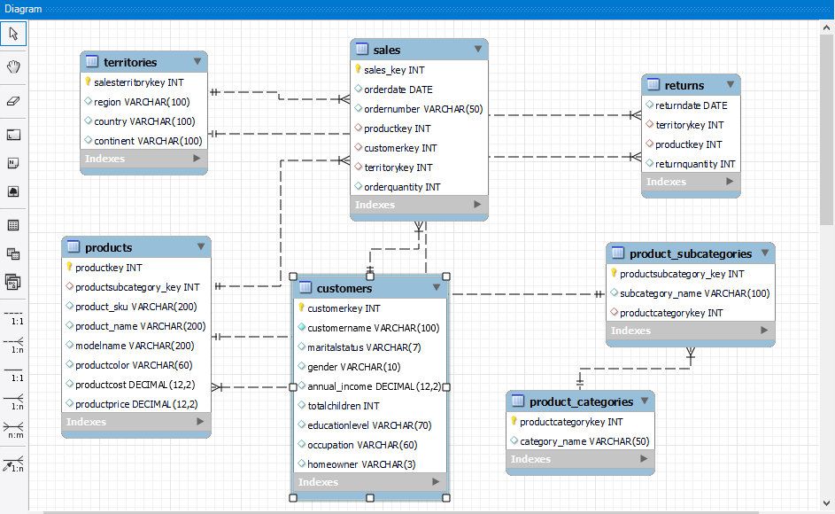

# End-to-End Retail Sales Analytics Pipeline using Python, SQL & Power BI

## Project Objective:
To analyze multi-dimensional retail sales data and uncover key revenue drivers, profit contributors, customer purchasing behavior, product category performance, and regional sales distribution by building a structured SQL-based analytical framework. The project aimed to convert raw e-commerce data into meaningful business intelligence insights that can support growth strategy, performance optimization, and risk identification.

#### ER Diagram

### 🛠 Tools & Technologies Used  
Python (Pandas) – Data cleaning and transformation  
MySQL Workbench – Database design, schema creation, data insertion, SQL analysis  
Power BI – Interactive dashboards and visualization  

### 📌 Key Responsibilities 

1. Cleaned and transformed raw CSV data using Pandas (handled missing values, ensured data consistency, formatted date fields).  

2. Designed a relational database schema with 6 interconnected tables:  
**Customers**  
**Products**  
**Product Categories**  
**Product Subcategories**  
**Sales**  
**Returns**  
**Territories**  

3. Created primary and foreign key relationships to maintain referential integrity.  

4. Wrote advanced SQL queries using:  
JOINs  
CTEs  
Window Functions (LAG, DENSE_RANK)  
Aggregations  

5. Calculated KPIs such as:  
**Total Revenue**  
**Total Profit**  
**Average Order Value**  
**Year-over-Year Growth**  

6. Built interactive Power BI dashboards to visualize:  
**Sales trends**  
**Customer insights**  
**Product performance** 
**Regional performance**  
**Return analysis**  

### 📊 Key Findings & Business Insights  
📈 Overall Business Performance  
**Total Orders: 25,164**  
**Total Revenue: ₹24.91 Million**  
**Total Profit: ₹10.45 Million**  
**Average Order Value (AOV): ₹990.09**  

👉 The company maintained a strong profit margin, indicating healthy pricing strategy and cost management.  

### 📆 Sales Trend Analysis  
2016 recorded 45.58% YoY growth, indicating strong business expansion.  
2017 experienced a slight decline of -1.49%, suggesting possible market saturation or operational challenges.  

### 🏆 Top Performing Products  
The Mountain-200 Bike series generated the highest profit across all products.  
Top profit-generating products:  

Mountain-200 Black, 46  
Mountain-200 Black, 42  
Mountain-200 Silver, 38  

### 👥 Customer Insights  
**Total Customers: 18,148**  
732 customers were inactive (never placed an order).  
Gender distribution is balanced (50% Male, 49% Female).  

👉 Insight:  
Strong opportunity for re-engagement campaigns targeting inactive customers.  
No heavy gender bias — marketing can remain neutral.  

### 🛍 Product & Category Insights  
Bikes category contributed ~94% of total revenue.  
Components category showed negligible/NULL sales.  
**Total SKUs: 293**  

### 🌍 Regional Performance  
Top Performing Region:  
**Australia – Highest revenue & order volume**  
Lowest Performing Regions:
**Central, Northeast, Southeast**  

### 🔁 Return Analysis  
**Total Returns: 1,828 units**  
Returns increased significantly in 2016 and 2017.  
Australia had the highest return volume.  
